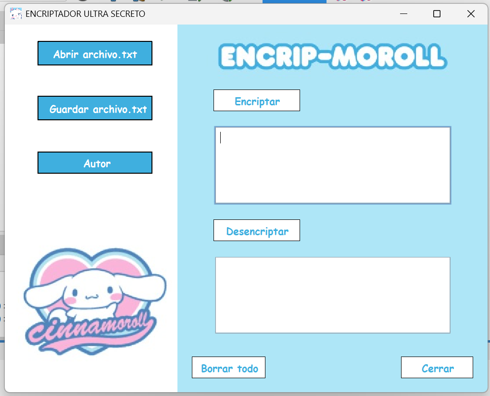
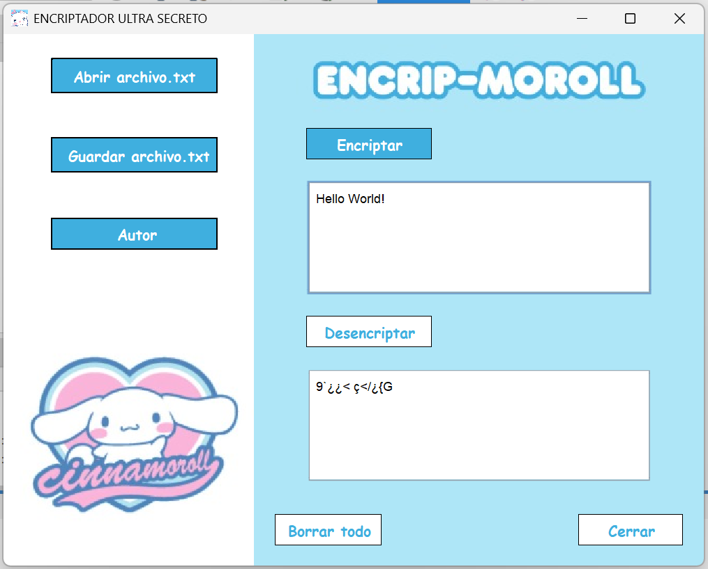

# EncriptadorChilemorron
A Sanrio cinnamon roll encryptor with the option to save to text files.

# CinnamonRollEncryptor

A simple Java encryption tool.  
It can encrypt and decrypt messages using basic encryption messages.

## Screenshots




## 🛠️ Technologies
- Java
- Swing
- Basic encryption algorithms

## 🚀 How to Run
1. Clone the repository
```bash
git clone https://github.com/asdf0506123/EncriptadorChilemorron.git
